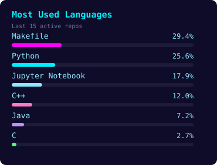

<div align="center">


</div>

<p align="center">
  
  
</p>

<p align="center">
  
</p>

<h3 align="center">🛰️ MISSION LOG // ABOUT ME</h3>

```yaml
class Ayush:
    location: "Vellore, India"
    currently_building: ["PlugPoint — P2P EV Charger Platform", "FTP_Server"]
    currently_learning: ["Advanced Frontend", "Flask", "FastAPI"]
    open_to: ["AI Projects", "Full-Stack Collab", "Cloud Systems"]
    contact: "ayush0987singh@gmail.com"
    fun_fact: "Ships code faster than light-speed... occasionally with bugs 🐛"
```

<p align="center">
  
</p>

<h3 align="center">📡 COMMS ARRAY // CONNECT WITH ME</h3>

<p align="center">
  <a href="https://linkedin.com/in/ayush-singh-560a29284">
    
  </a>
  <a href="mailto:ayush0987singh@gmail.com">
    
  </a>
  <a href="https://leetcode.com/u/Ayush_21f3001194/">
    
  </a>
  <a href="https://codeforces.com/profile/Ayush687141">
    
  </a>
  <a href="https://www.hackerrank.com/profile/21f30011941">
    
  </a>
</p>

<p align="center">
  
</p>

<h3 align="center">⚙️ TECH ARSENAL</h3>

<p align="center">
  
</p>

<p align="center">
  
</p>

<h3 align="center">📊 SYSTEM DIAGNOSTICS // GITHUB STATS</h3>

<p align="center">
  
  
</p>

<p align="center">
  
</p>

<p align="center">
  
</p>

<p align="center">
  
</p>

<p align="center">
  
</p>

<h3 align="center">🚀 FEATURED PROJECTS</h3>

<p align="center">
  <a href="https://github.com/Ayush59699/Map-Reduce-Framework-Distributed-File-System">
    
  </a>
  <a href="https://github.com/Ayush59699/Local-RAG-Multi-Query-Retriever">
    
  </a>
  <a href="https://github.com/Ayush59699/Distributed_Payment_Microservice">
    
  </a>
  <a href="https://github.com/Ayush59699/Multithreaded_Web_Crawler">
    
  </a>
  <a href="https://github.com/Ayush59699/Store-Intelligence-API-">
    
  </a>
  <a href="https://github.com/Ayush59699/PlugPoint">
    
  </a>
  <a href="https://github.com/Ayush59699/FTP_Server_Ayush">
    
  </a>
</p>

<p align="center">
  
</p>

<p align="center">
  <i>// End of transmission — thanks for stopping by 👽</i>
</p>
